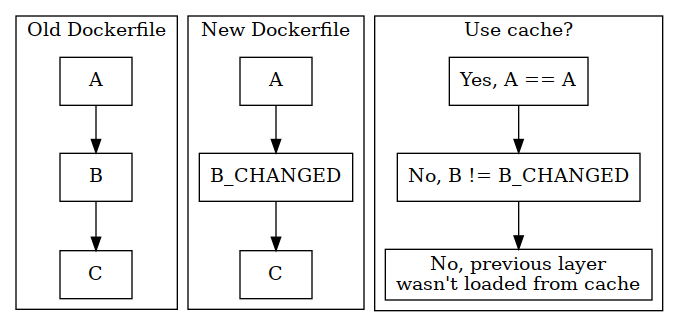

# Docker caching model

Each text command will have a corresponding cache. `Copy` command will check if all files in the source have not changed.

> If the cache can’t be used for a particular layer, all subsequent layers won’t be loaded from the cache.

## Designing your Dockerfile for caching

- Only copy in the files you need for the next step, to minimize cache invalidation in the build process.
- Make sure not to invalidate the cache accidentally by having an command early in the Dockerfile that always changes, e.g. a `LABEL` that contains the build timestamp.

---

## References

- [Docker caching model](https://pythonspeed.com/articles/docker-caching-model/)
