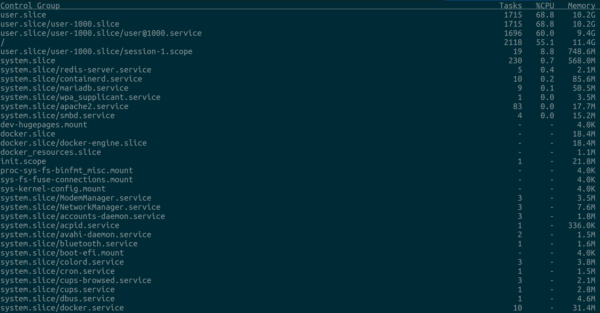

# Managing docker resources

## Ubuntu Local setup

- By default docker engine takes up all the system resources and allocates them to the containers.
- We can restrict the system resources available to docker engine through systemd cgroup and slices.

### Systemd unified control group hierarchy

- To check if the kernel supports `cgroupv2` run the command `grep cgroup /proc/filesystems`. We should see both `cgroup` and `cgroup2` in the output.

- If the kernel supports both versions of cgroup, to check what cgroup version kernel is currently using run `mount | grep cgroup` and if we get output like `cgroup2 on /sys/fs/cgroup type cgroup2 (rw,nosuid,nodev,noexec,relatime,nsdelegate,memory_recursiveprot)` we are currently on cgroup2.

- Docker 20.10 onwards supports using `cgroup2`. To ensure **systemd** to use `cgroup2` we should add the following setting to `/etc/default/grub`

```Conf
# this enables systemd to use cgroupv2 and disables swap for docker
GRUB_CMDLINE_LINUX="cgroup_enable=memory swapaccount=0 systemd.unified_cgroup_hierarchy=1"`
```

- Execute the command `sudo update-grub` and reboot the system

### Configuring docker daemon to use systemd cgroup

By default, the docker when launched using systemd command `sudo systemctl start docker.service`, the process is created under the `cgroupfs` cgroup.

To verify which cgroup driver(cgroupfs/systemd) the docker daemon is running, we can run the `docker info` command. This will display `cgroupfs` as the **Cgroup Driver**.

To change the cgroup driver to `systemd`, we need to add the following settings to `/etc/docker/daemon.json`.

```JSON
{
    "exec-opts": ["native.cgroupdriver=systemd"]
}
```

After modifying the docker daemon configuration, run `sudo systemctl restart docker.service` and check the cgroup driver again using `docker info`.

We can also verify the same using the `systemd-cgtop` command. You can notice the `docker.service` running under `system.slice.`



Personally I leave the docker daemon to belong to the systemd cgroup. But we can also make the daemon to run as part of a separate cgroup using a custom `systemd.slice` file.

### Assign custom cgroup to the docker daemon

We can make the docker daemon to be a part of different control group using the following steps.

1. We should first create `systemd.slice` file say `docker_engine.slice` and configure the cpu and memory

```Conf
[Unit]
Description=Slice with Memory limit and CPU limit for docker
Before=slices.target

[Slice]
CPUAccounting=true
CPUQuota=75%
MemoryAccounting=true
MemoryHigh=1G
MemoryMax=1.2G
```

2. Add the `Slice` setting under `Service` section in the `/etc/systemd/system/multi-user.target.wants/docker.service` file.

```Conf
[Service]
# note I have used underscore and not hyphen in the name.
Slice=docker_engine.slice
```

3. Run the following commands for the changes to take effect.

```Bash
sudo systemctl stop docker.service
sudo systemctl daemon-reload
sudo systemctl start docker.service

# Verify the cgroup in the below command output.
systemctl status docker.service
```

**NOTE**- Beware of the slice file naming convention. Hyphen means hierarchy in the systemd slice file naming. `docker-engine.slice` refers to **docker-engine** subgroup under **docker** cgroup. We can verify the same in the `/sys/fs/cgroup` folder. The hierarchy will look like `/sys/fs/cgroup/docker.slice/docker-engine.slice`

### Cgroup for containers only

We can make the docker daemon to launch all the containers running under a different cgroup. This is very important when running locally because we don't want the containers to take up all the memory. So we want to make only certain amount of the system resources available to all the containers.

1. Create `docker_resources.slice` file specifying the resource limit for all the containers. Since all the containers we will be launching will use resources limited to this cgroup, we should assign in such a way that containers can run at the same time don't use up all of the system resources.

```Conf
[Unit]
Description=Slice with Memory limit and CPU limit for docker
Before=slices.target

[Slice]
CPUAccounting=true
CPUQuota=75%
MemoryAccounting=true
MemoryHigh=8G
MemoryMax=10G
```

2. Add the following configuration to the existing settings in `/etc/docker/daemon.json` so that all containers created under the `docker_resources` cgroup

```JSON
{
    "cgroup-parent": "docker_resources.slice"
}
```

3. Always restart the docker daemon after changing the configuration using `sudo systemctl restart docker.service`
4. Launch an interactive container and run the command `systemd-cgtop` to verify if the containers are launched under the `docker_resources` cgroup.
5. We can verify the CPU and memory limit using the [progrium/stress image](https://hub.docker.com/r/progrium/stress/). For verifying the memory limit, we should **disable swap** for containers.

```Bash
# verify
docker run --rm -it progrium/stress --cpu 1

# verify memory limit
docker run --rm -it progrium/stress --cpu 1 --vm 1 --vm-bytes 1024M
```

## Swap

Its recommended to disable swap when running containers to exactly monitor the resource usage.

### Disabling swap

- `docker info` - If the output of this command contains **WARNING: No swap limit support**, then the swap if already disabled.
- If there is no warning, then follow these steps to disable swap to cgroups
- Add `GRUB_CMDLINE_LINUX="cgroup_enable=memory swapaccount=0"` to **/etc/default/grub**, and execute `sudo update-grub`
- Reboot the system
- Verify if the swap warning appears when running the `docker info`.

### Enabling swap

- `docker info` - If the output of this command contains **WARNING: Noswaplimitsupport**, then do the following as root user (below steps are applicable for ubuntu)
- Add `GRUB_CMDLINE_LINUX="cgroup_enable=memory swapaccount=1"` to **/etc/default/grub**. Save the file
- Execute `sudo update-grub` and reboot

Verify if the warning has disappeared after reboot with `docker info`

---

## References

- [Docker resource management via Cgroups and systemd](https://baykara.medium.com/docker-resource-management-via-cgroups-and-systemd-633b093a835c)
- [cgroup with systemd primer](https://www.redhat.com/sysadmin/cgroups-part-four)
- [How to limit Docker total resources?](https://unix.stackexchange.com/questions/537645/how-to-limit-docker-total-resources)
- [Enable docker swap support](https://unix.stackexchange.com/questions/342735/docker-warning-no-swap-limit-support)
- [Restricting swap usage and cgroupv2 for a systemd service in Ubuntu 18.04](https://serverfault.com/questions/1068499/restricting-swap-usage-for-a-systemd-service-in-ubuntu-18-04)
- [How to enable Control Group v2](https://sleeplessbeastie.eu/2021/09/10/how-to-enable-control-group-v2/)
- [Docker support for cgroupv2](https://rootlesscontaine.rs/getting-started/docker/)
- [Cgroupv2 check and enable](https://rootlesscontaine.rs/getting-started/common/cgroup2/)
