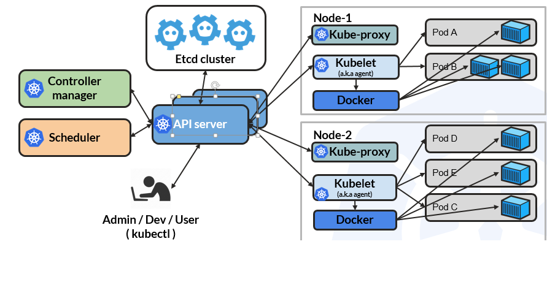

# Kubernetes terminology

- **K8s**(8- indicates 8 letters between K and s) or **kube** abbreviation for kubernetes
- Kubectl(Kube control) - CLI to configure Kubernetes and manage apps
- Node - single server in the kubernetes cluster. Manager and worker/data nodes

## Components in Manager nodes

Control plane(master/manager nodes) - Set of containers that manage the cluster. It includes API server, scheduler, controller manager, etcd and more.

- **Etcd** - Key/value backing store to store the cluster data.
- API server - frontend API for the control plane. Can scale horizontally.
- Scheduler - schedules the newly created pods to run on the available nodes
- Controller manager - runs various controllers to manage state of the cluster
- Core DNS

We can add more addons(storage, networking) to the control plane. Each will run as its own containers.

### Controller manager

- Controller - For creating/updating pods and other objects. Checks if the pods are running in the desired configuration. There are many types of controllers - Deployment, ReplicaSet, StatefulSet, DaemonSet, Job, CronJob etc.

- Node controller - respond when nodes go down
- Replication controller - Ensure specified replica of pods are running
- Endpoints controller - Populates the endpoint objects
- Service Account and Token Controllers - Create default accounts and API access tokens for new namespaces

## Components in worker nodes

- Worker Nodes - Run app containers. Each worker node will have kubelet (agent) and kube proxy(controls networking) running
- Kubelet - Kubernetes agent running on nodes. This agent continuously watches API server.
- Kube-proxy - proxy service that runs on each worker nodes to perform network operations like request forwarding to pods/containers

## Pods

- Pod - basic unit of deployment. We deploy pods and not containers. **Pod refers to one or more container running together in a single Node**. Pods encapsulate the containers.

- Pod - Abstraction. **all containers in one pod will share IP address** and will be deployed on to the same node.
- Kubernetes then creates containers by communicating with kubelets(agents) which inturn communicates with the container runtime(docker, containerd, CRI-O etc) to create the containers.
- Every resource to run container uses Pods.
- Only containers of same pod can share shared storage

## Service

- Abstraction defining a logical set of pods with policy to access those pods.
- Network endpoint to connect to a pod(DNS name and port).

## Jobs

- Create specified number of Pods. Ensures successful completion of pods.
- Once all created pods are complete, the job is considered completed.

## CronJob

- Job scheduler in K8s

## ReplicaSets

- Ensures given number of replicas for a pod are running.

## Namespace

- Filtered group of objects in cluster. A way to filter views in the `kubectl` command. This helps isolate resources of a team when sharing a large cluster(isolated workspace).

---

## References

- [Kubernetes architecture](https://cheatography.com/gauravpandey44/cheat-sheets/kubernetes-k8s/)
